#  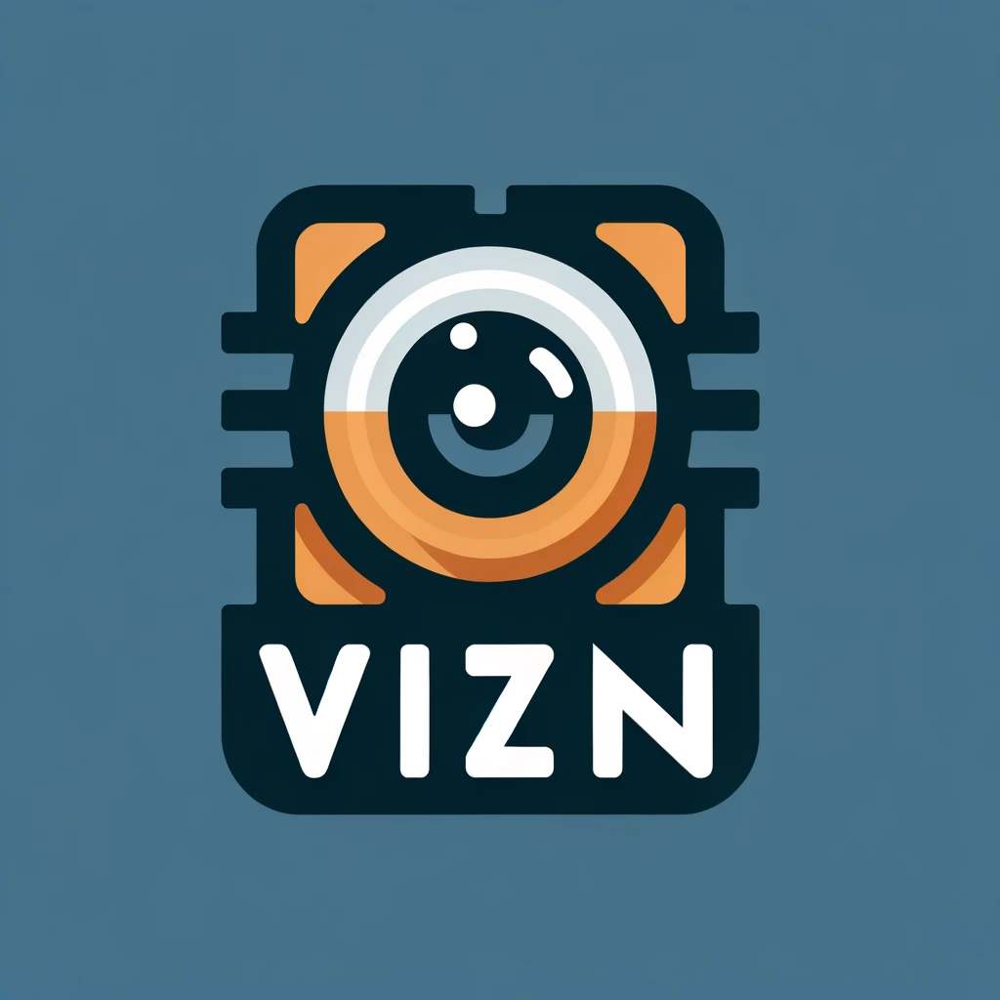 VIZN: Illuminating Faces 

### Colaborators
Jacob Mccalip, Daemon Henry Mutka, Julio cantu

## About VISN

Our final machine vision project, VIZN, was made with the intention to collectively use what we learned in class to detect faces from different images. To do so we used Adaboost as the backbone and Cascade Classifiers as its framework to build the trained model. For detecting we also implemented a Skin Detection functionality to heavily reduce the data the model will need to sort through.

## File list
- `README.md` - This file
- `.gitignore` - This file tells git which files to ignore.
- `train.py` - Called to train and output a pkl of the trained data 
- `test.py` - Used along with a 1 or 2 to call either test1 or test 2 
- `test1.py` - Basic training programs for the trained face detector
- `test2.py` - Advanced traning programs for the trained face detector
- `requirements.txt` - Where the needed imports are located
- `config.py` - Holds directory locations
- `face_detection_model.pkl` - Facial detection model based off of just AdaBoosting
- `face_detection_cascade.pkl` - Facial detection model using AdaBoost and cascade clasifiers
- `sampleTestPyResults.txt` - Where the results are stored from the test programs
- `testing.py` - Where testing of cropped faces, and non face images are cunducted using a cascade of boosted clasifiers
- `skin_detection.py` - Used to create a(n) basic skin detection mask to use along with the trained model
- `processing.py` - where functionalities to load and process data is located 
- `nms.py` -
- `newSkin.py` - Used to create a(n) advanced skin mask using the UCI histogram
- `model.py` - This file is holds the functions to save, load, or train the model
- `cascade.py` - 
- `boosting.py` - File used to cunduct the AdaBoosting technique 
- `UCI_Skin_NonSkin.txt` - Histogram for skin and non-skin data
- `/important_outputs` - In the folder is where the basic and advanced data goes, along with the detected skin

## flowchart of application

<p align="center">
Original Photo
</p>
<p align="center">
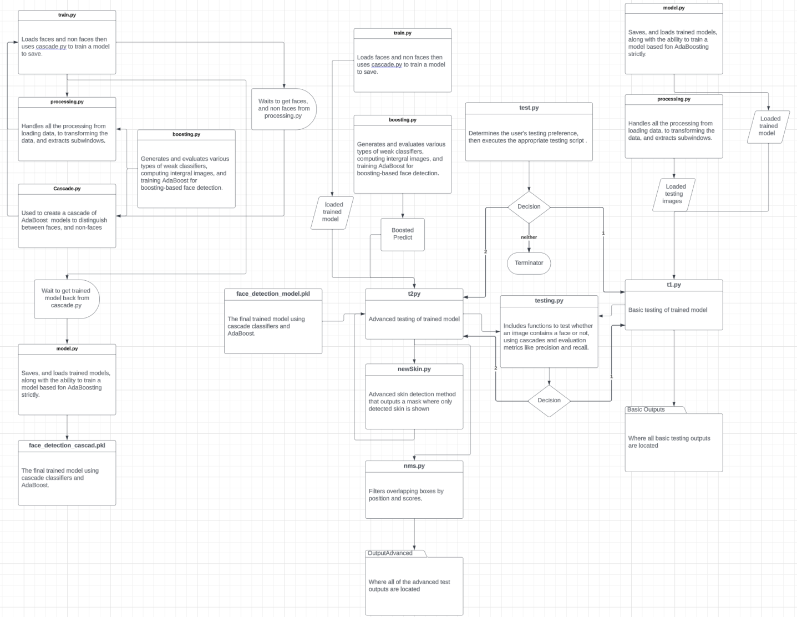
</p>

## Setting up the environment

If you are running the code on your own machine, make sure python is installed and set up a virtual environment `venv`. make sure to also have `opencv` installed, you can do so you can use the `requirements.txt` file by using the following command in your terminal:

```bash
pip install -r requirements.txt
```

In vs code you can use `cmd + shift + p` to pull up the terminal to create a python enviornment, after chose `python create` then `venv` to finish setting up your enviornment run the command above in your terminal

## Running the code

You can run your code using the following commands:

The reposotory has a trained model, yet if you would like to train your own.
```bash
python train.py
```

## Running the tests

To run the tests make sure your in the main directory, not src, and run the following command:

```bash
python test.py
```

After, you will a prompt that will ask if you are on Windows (1) or Linux (2) and will be asked to put in an input 

Placed cropped image of prompt here

Following you will recive another prompt asking if you would like to comence the Basic Testing (1) or the Advanced Testing (2)

Placed cropped image of prompt here

## Results

<p align="center">
Original Photo
</p>
<p align="center">
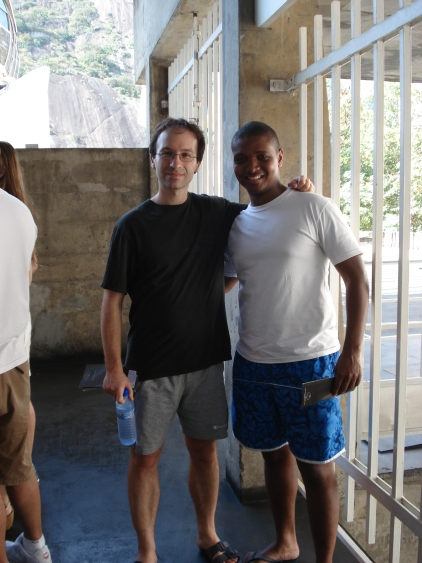
</p>


| Basic Skin Mask | Advanced Skin Mask | Basic Test | Advanced Test |
| :---: | :---: | :---: | :---: |
| 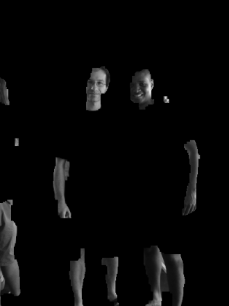 | 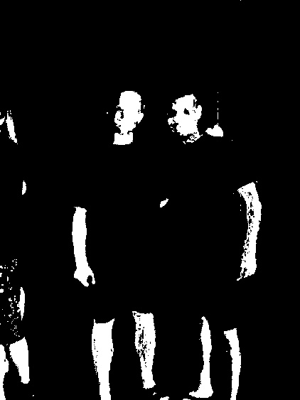 | 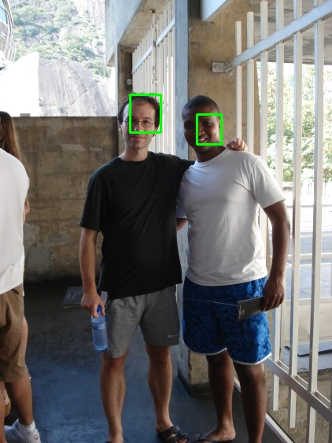 | 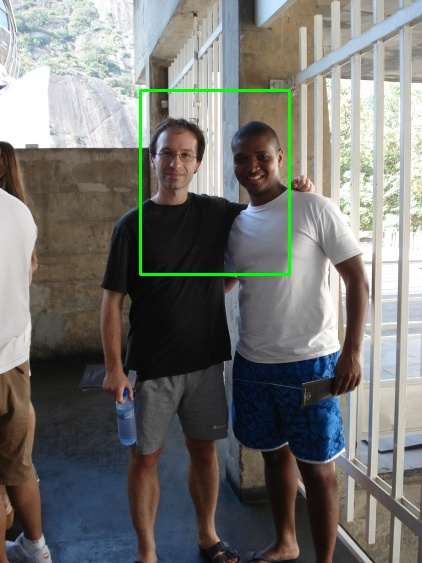 |


<p align="center">
Original Photo
</p>
<p align="center">

</p>


| Basic Skin Mask | Advanced Skin Mask | Basic Test | Advanced Test |
| :---: | :---: | :---: | :---: |
| 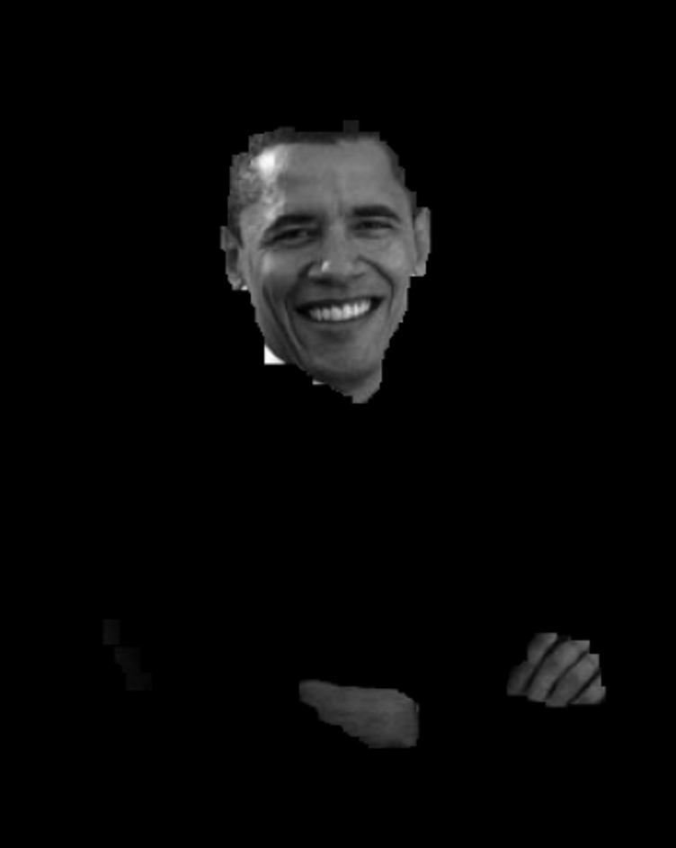 | 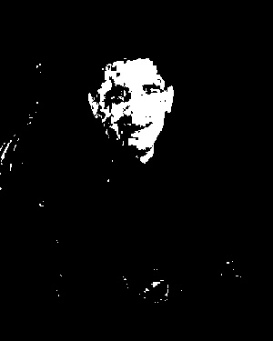 | 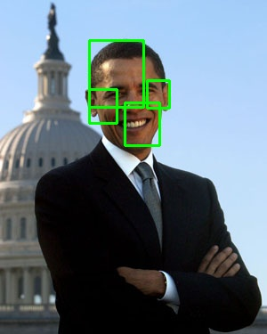 | 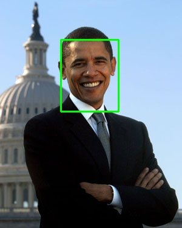 |


<p align="center">
Original Photo
</p>
<p align="center">
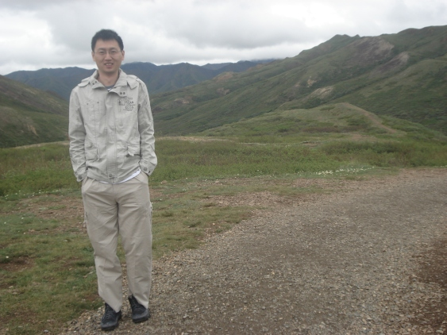
</p>


| Basic Skin Mask | Advanced Skin Mask | Basic Test | Advanced Test |
| :---: | :---: | :---: | :---: |
| 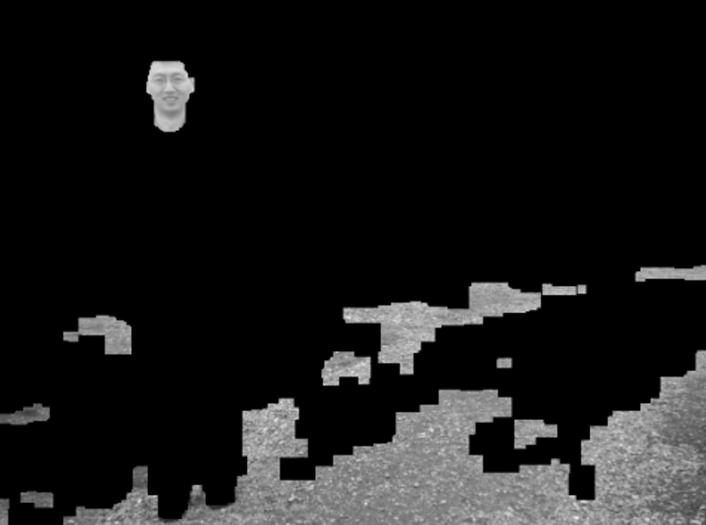 | 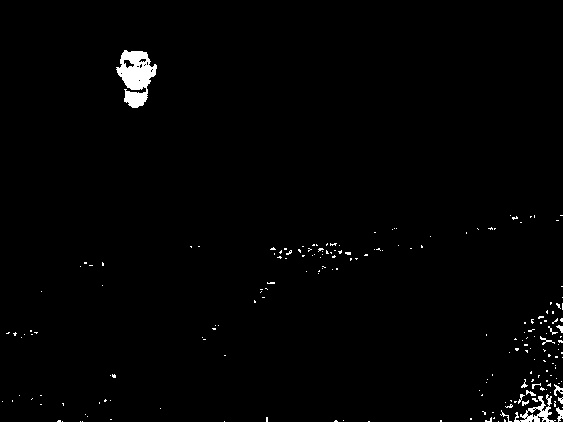 | 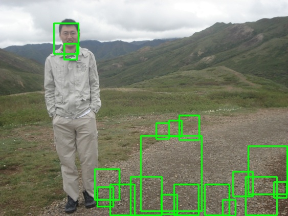 | 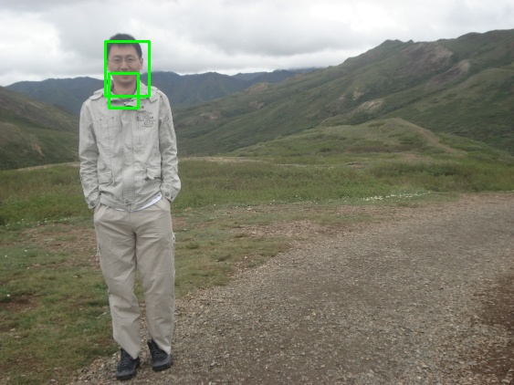 |


